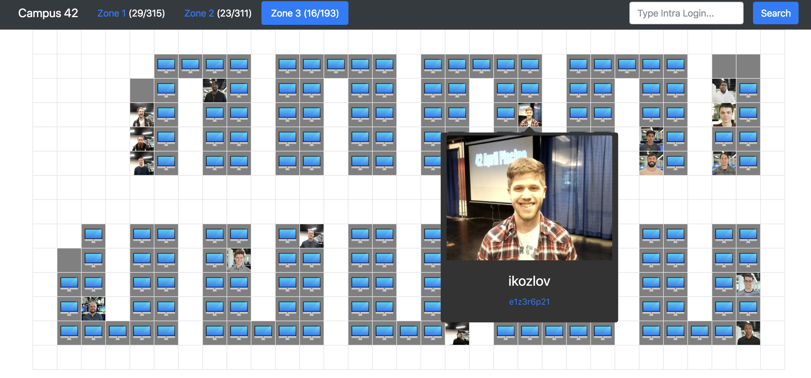

# 42 Campus
<a href="https://campus.42.us.org" target="_blank">42 Campus</a>
(available only inside the 42 network) is a website that allows 42 Silicon Valley students to find each other on the map. It is written in Python Django and uses 42 API to access users locations.



## Requirements
You will need to have *Python 3* and *pip 3* installed to run this project.

**Also you will need to create a [42 Intra Application](https://profile.intra.42.fr/oauth/applications/new) and copy your application ID and application Secret into corresponding variables in the top of the `/website/views.py`**:


## Installation
   ```bash
   git clone https://github.com/AlexEzzeddine/campus42.git campus # clone the repo
   cd campus
   python3 -m venv --prompt campus env # create virtual environment
   source env/bin/activate # enable virtual environment
   pip install -r requirements.txt # install dependencies
   ```
## Usage
   
Run a server with:

```bash
./manage.py runserver
```

or

```bash
./manage.py runserver -s 0:port
```

where `0` is a shortcut for `0.0.0.0` to make your website publicly available and `port` is a desired port number

Now you can access the website at `localhost:8000`

When you are done:

   1. Press `Ctrl + C` to stop the server.

   2. Type `deactivate` in your shell to disable virtual environment.
